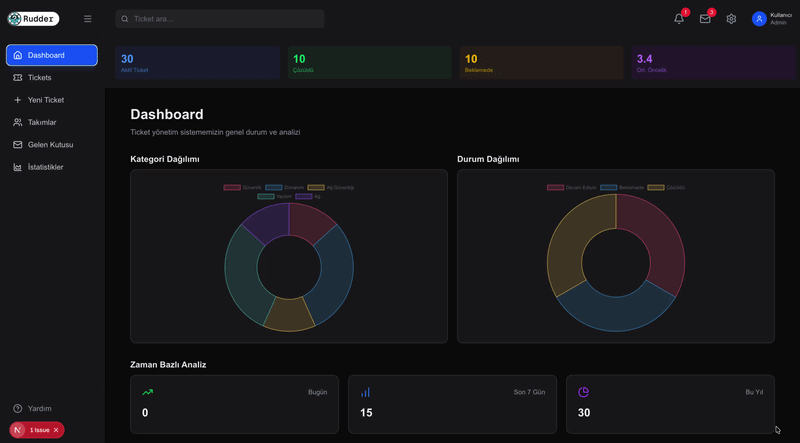

# 🎫 Ticket Dashboard (Destek Talebi Yönetim Sistemi)

Modern, hızlı ve tam kapsamlı bir destek talebi (ticket) ve analiz yönetim paneli. Bu proje; kullanıcıların teknik ve operasyonel sorunlar için destek talepleri oluşturmasını, güncellemesini, kategorilere göre filtreleyip takip etmesini ve detaylı istatistiklerle sistem genelini analiz etmesini sağlar.

---

## Ekran Görüntüsü



## 🚀 Özellikler

- **📊 Kapsamlı Dashboard & Analitik:**
  - **Kategori Dağılımı:** Taleplerin kategorilere göre dağılımını gösteren interaktif Doughnut grafikler (_Chart.js_).
  - **Durum Analizi:** Çözülen, beklemede ve devam eden bilet oranları.
  - **Zaman Bazlı Metrikler:** Bugün, son 7 gün ve bu yıl oluşturulan talep sayaçları.
- **📑 Ticket Yönetimi & Gruplama:**
  - Talepleri kategorilerine göre gruplanmış kartlar halinde listeleme.
  - İlerleme durumu (Progress bar), öncelik derecesi (1-5 yıldız/skor) ve durum etiketleri (_Beklemede_, _Devam Ediyor_, _Çözüldü_).
- **✍️ Dinamik Form & CRUD İşlemleri:**
  - Tek sayfa ve dinamik rotalama (`/ticket/[mode]`) ile hem yeni talep oluşturma hem de mevcut talepleri düzenleme.
  - Kapsamlı doğrulama ve kullanıcı dostu form kontrolleri.
- **⚡ Yüksek Performanslı Altyapı:**
  - **Next.js 16 (App Router)** ve **React 19** mimarisi.
  - React Suspense ve özel yükleme (loading) durumları ile akıcı kullanıcı deneyimi.
- **🗄️ Veritabanı Optimizasyonu:**
  - **MongoDB** & **Mongoose** entegrasyonu.
  - Serverless ortamlara uyumlu bağlantı önbellekleme (cached connection) mekanizması.
- **🎨 Modern ve Şık Arayüz:**
  - **Tailwind CSS v4** ile tasarlanmış karanlık tema (dark mode) odaklı, modern ve responsive UI.
  - **Lucide React** ikon kütüphanesi.

---

## 🛠️ Kullanılan Teknolojiler

| Alan                             | Teknoloji                                                                                 |
| -------------------------------- | ----------------------------------------------------------------------------------------- |
| **Framework**                    | [Next.js 16](https://nextjs.org/) (App Router)                                            |
| **Kütüphane**                    | [React 19](https://react.dev/)                                                            |
| **Dil**                          | [TypeScript](https://www.typescriptlang.org/)                                             |
| **Veritabanı & ORM**             | [MongoDB](https://www.mongodb.com/) & [Mongoose](https://mongoosejs.com/)                 |
| **Stil / CSS**                   | [Tailwind CSS v4](https://tailwindcss.com/)                                               |
| **Grafik & Veri Görselleştirme** | [Chart.js](https://www.chartjs.org/) & [react-chartjs-2](https://react-chartjs-2.js.org/) |
| **İkonlar**                      | [Lucide React](https://lucide.dev/)                                                       |

---

## 📂 Proje Dizin Yapısı

```bash
ticketdashboard/
├── public/                 # Statik varlıklar ve görseller
├── src/
│   ├── app/                # Next.js App Router (sayfalar ve API rotaları)
│   │   ├── api/            # Backend API uç noktaları
│   │   │   ├── models/     # Mongoose şema ve modelleri (Ticket)
│   │   │   ├── statistics/ # İstatistik hesaplama endpoint'i
│   │   │   └── tickets/    # Bilet CRUD endpoint'leri
│   │   ├── ticket/[mode]/  # Ticket ekleme ve düzenleme sayfası
│   │   ├── tickets/        # Tüm ticket'ların listelendiği sayfa
│   │   ├── layout.tsx      # Ana sayfa düzeni (Sidebar, Header vb.)
│   │   └── page.tsx        # Ana Dashboard sayfası
│   ├── components/         # Yeniden kullanılabilir UI bileşenleri
│   │   ├── form/           # Form ve input bileşenleri
│   │   ├── header/         # Üst menü/başlık bileşeni
│   │   ├── home/           # Dashboard sayaç ve grafik bileşenleri
│   │   ├── sidebar/        # Yan navigasyon menüsü
│   │   └── tickets/        # Ticket kartları ve grid bileşenleri
│   ├── types/              # TypeScript tip tanımları ve arayüzler
│   └── utils/              # MongoDB bağlantısı ve API servis fonksiyonları
├── .env                    # Ortam değişkenleri
├── package.json
└── tsconfig.json
```

---

## 🔌 API Referansı

### Ticket Endpoints

| Metot  | Uç Nokta           | Açıklama                                            |
| ------ | ------------------ | --------------------------------------------------- |
| `GET`  | `/api/tickets`     | Tüm destek biletlerini listeler.                    |
| `POST` | `/api/tickets`     | Yeni bir destek bileti oluşturur.                   |
| `GET`  | `/api/tickets/:id` | Belirtilen ID'ye sahip biletin detaylarını getirir. |
| `PUT`  | `/api/tickets/:id` | Belirtilen ID'ye sahip bileti günceller.            |

### İstatistik Endpoints

| Metot | Uç Nokta          | Açıklama                                                                                |
| ----- | ----------------- | --------------------------------------------------------------------------------------- |
| `GET` | `/api/statistics` | Dashboard için genel durum, kategori/durum dağılımları ve zaman bazlı analizleri döner. |

---

## 📋 Ticket Veri Modeli

Destek biletleri Mongoose üzerinden şu şema doğrulamasıyla saklanır:

```typescript
{
  title: string; // Zorunlu başlık
  description: string; // Zorunlu açıklama
  // 'Yazılım Sorunu' | 'Donanım Sorunu' | 'Bağlantı Sorunu' | 'Diğer'
  category: priority: number; // 1 ile 5 arası öncelik seviyesi
  progress: number; // 0 - 100 arası ilerleme yüzdesi
  // 'Beklemede' | 'Devam Ediyor' | 'Çözüldü'
  status: createdAt: string; // Otomatik oluşturulma tarihi (timestamps)
  updatedAt: string; // Otomatik güncellenme tarihi (timestamps)
}
```

---

## ⚙️ Başlangıç & Kurulum

### Ön Gereksinimler

- [Node.js](https://nodejs.org/) (v18.17 veya üzeri önerilir)
- [MongoDB](https://www.mongodb.com/) (Yerel kurulu veya MongoDB Atlas bağlantısı)
- [npm](https://www.npmjs.com/) ya da alternatif bir paket yöneticisi (yarn, pnpm, bun)

### 1. Projeyi Klonlayın

```bash
git clone https://github.com/kullanici-adi/ticketdashboard.git
cd ticketdashboard
```

### 2. Bağımlılıkları Yükleyin

```bash
npm install
```

### 3. Çevre Değişkenlerini (Environment Variables) Tanımlayın

Kök dizinde `.env` (veya `.env.local`) dosyası oluşturup aşağıdaki değişkenleri ekleyin:

```env


# Uygulama URL'i (Next.js server bileşenlerinde fetch çağrıları için)
NEXT_PUBLIC_APP_URL="http://localhost:3000"
```

### 4. Geliştirme Sunucusunu Başlatın

```bash
npm run dev
```

Tarayıcınızda [http://localhost:3000](http://localhost:3000) adresine giderek uygulamayı görüntüleyebilirsiniz.

---

## 📦 Mevcut Komutlar

- `npm run dev` - Geliştirme (development) sunucusunu başlatır.
- `npm run build` - Canlı ortam için optimize edilmiş üretim (production) derlemesini oluşturur.
- `npm run start` - Üretim derlemesini çalıştırır.
- `npm run lint` - ESLint kontrollerini çalıştırır.

---

## 🤝 Katkıda Bulunma

1. Bu depoyu fork edin.
2. Yeni bir özellik dalı oluşturun (`git checkout -b feature/yeni-ozellik`).
3. Değişikliklerinizi commit edin (`git commit -m 'feat: yeni özellik eklendi'`).
4. Dalınıza push yapın (`git push origin feature/yeni-ozellik`).
5. Bir **Pull Request** açın.

---

## 📄 Lisans

Bu proje kişisel gelişim ve açık kaynak kullanımı için hazırlanmıştır. Detaylar için lisans dosyasını inceleyebilirsiniz.
